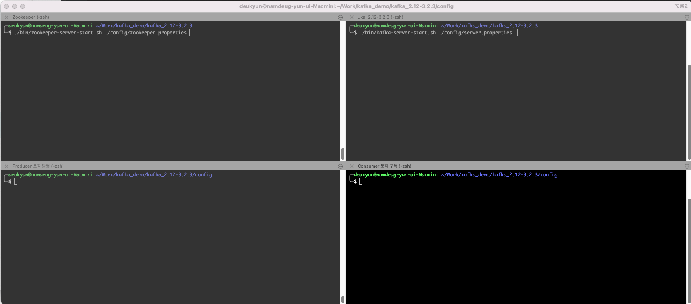
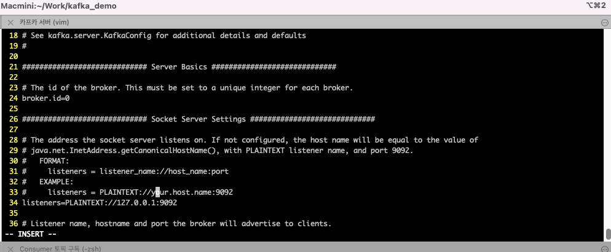
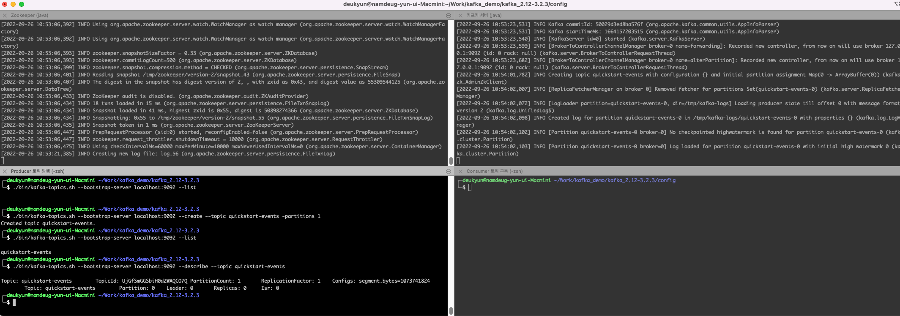
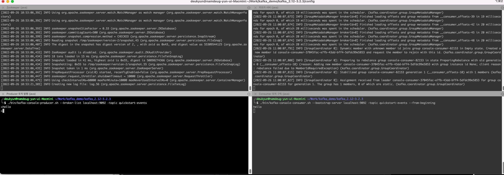

## 1. Producer/Consumer 실습

### 1. 주키퍼 실행
```
./bin/zookeeper-server-start.sh ./config/zookeeper.properties
```

### 2. 카프카 서버 실행
```
./bin/kafka-server-start.sh ./config/server.properties
```


카프카 서버에서 예외 발생..
```
[2022-09-26 10:41:24,327] INFO [Controller id=0, targetBrokerId=0] Node 0 disconnected. (org.apache.kafka.clients.NetworkClient)
[2022-09-26 10:41:24,328] WARN [Controller id=0, targetBrokerId=0] Connection to node 0 (/218.38.137.27:9092) could not be established. Broker may not be available. (org.apache.kafka.clients.NetworkClient)
[2022-09-26 10:41:24,333] INFO [Controller id=0, targetBrokerId=0] Client requested connection close from node 0 (org.apache.kafka.clients.NetworkClient)
[2022-09-26 10:41:54,448] INFO [Controller id=0, targetBrokerId=0] Disconnecting from node 0 due to socket connection setup timeout. The timeout value is 9499 ms. (org.apache.kafka.clients.NetworkClient)
[2022-09-26 10:41:54,455] INFO [Controller id=0, targetBrokerId=0] Client requested connection close from node 0 (org.apache.kafka.clients.NetworkClient)
```

-> 
server.properties 파일의 34번째 라인 주석풀고 내용 변경



### 2.5. 현재 토픽 확인
```text
./bin/kafka-topics.sh --bootstrap-server localhost:9092 --list
```

### 3. 토픽 생성
```text
./bin/kafka-topics.sh --bootstrap-server localhost:9092 --create --topic quickstart-events -partitions 1
```

### 3.1 토픽 정보 자세히 출력
```text
./bin/kafka-topics.sh --bootstrap-server localhost:9092 --describe --topic quickstart-events
```



### 4 콘솔 프로듀서 컨슈머 테스트
```
./bin/kafka-console-producer.sh --broker-list localhost:9092 -topic quickstart-events
```

```text
./bin/kafka-console-consumer.sh --bootstrap-server localhost:9092 -topic quickstart-events --from-beginning
```


