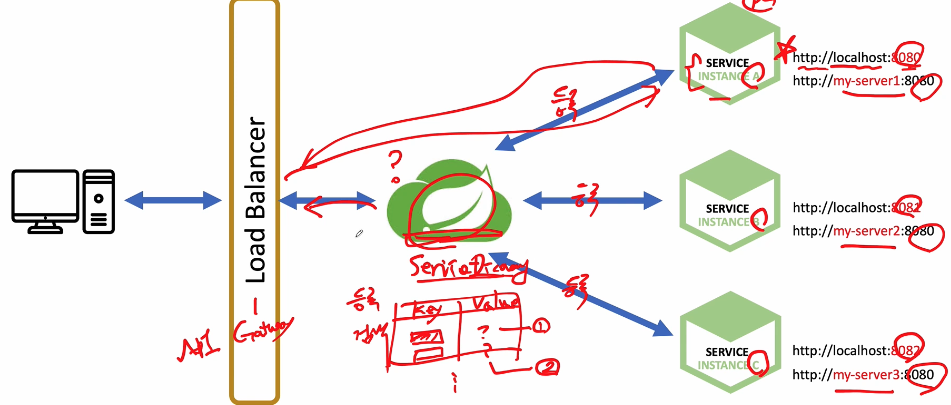

Service Discovery
- Client 가 서비스를 호출할때 서비스의 위치 (IP, port) 를 알아낼 수 있는 기능을 제공하는 서비스
- 일종의 전화번호 부




## ServiceDiscovery 프로젝트 구성

```java
@EnableEurekaServer // ->  EurekaServerAutoConfiguration 를 동작 시킨다
@SpringBootApplication
public class ServiceDiscoveryApplication {

	public static void main(String[] args) {
		SpringApplication.run(ServiceDiscoveryApplication.class, args);
	}

}
```

```yaml
server:
  port: 8761

spring:
  application:
    name: service-discovery

eureka:
  client:
    register-with-eureka: false
    fetch-registry: false
```

## 사용자 서비스를 세팅
```yaml
server:
  port: 0

spring:
  application:
    name: user-service

eureka:
  instance:
    instance-id: ${spring.cloud.client.hostname}:${spring.application.instance_id:${random.value}}

  client:
    register-with-eureka: true
    fetch-registry: true
    service-url:
      defaultZone: http://127.0.0.1:8761/eureka
```