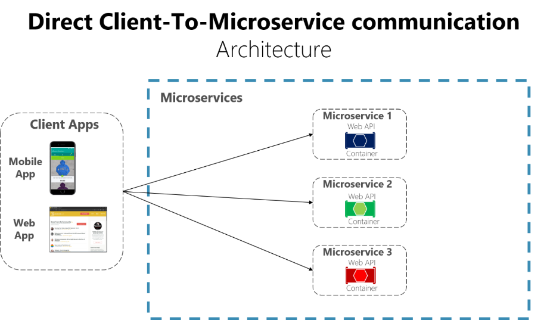
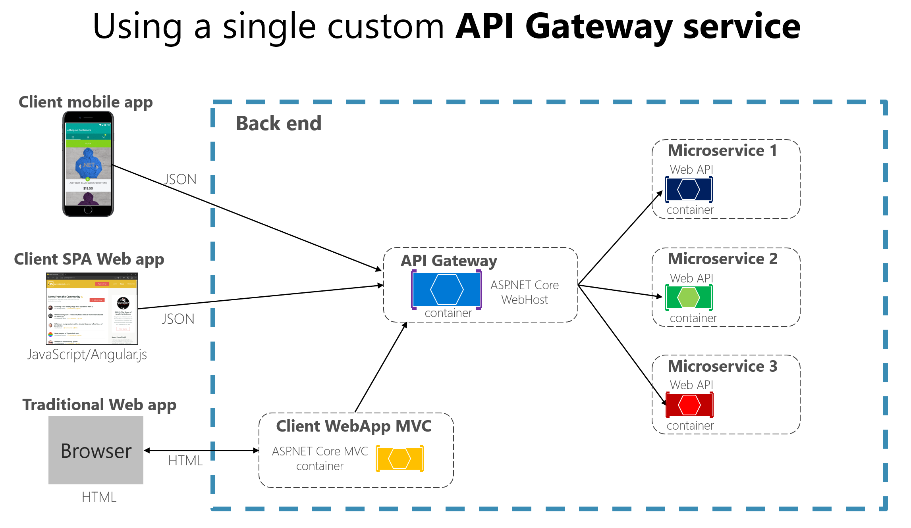

# Api Gateway 가 없다면


# Api Geteway 가 있다면


@See)
 Miscrosoft The API gateway pattern versus the Direct client-to-microservice communication [link](https://learn.microsoft.com/en-us/dotnet/architecture/microservices/architect-microservice-container-applications/direct-client-to-microservice-communication-versus-the-api-gateway-pattern)

 # Netflix Ribbon
Spring Cloud 에서의 MSA 간 통신
- RestTemplate
    ```java
    RestTemplate restTemplate = new RestTeamplte();
    restTemplate.getForObject("http://localhost:8080/", User.class, 200);
    ```
- FeignClient 
    ```java
    @FeignClinet("stores")
    public interface StoreClient {

        @RequestMapping(method = RequestMethod.GET, value="/stores")
        List<Store> getStores();
    }
    ```

Ribbon : `Client side` Load Balancer


# Spring Cloud Gateway

-> 라우터 등록 yaml 설정
```yaml
spring:
  application:
    name: api-gateway-service
  cloud:
    gateway:
      default-filters:    ## 글로벌 필터 (모든 라우트에 적용된다)
        - name: GlobalFilter
          args:
            baseMessage: haha
            preLogger: true
            postLogger: true

      routes:
        - id: first-service                             #라우트 정보
#          uri: http://localhost:8001   
          uri: lb://MY-FIRST-SERVICE
          predicates:
            - Path=/first-service/**
          filters:                                          #필터  
            - AddRequestHeader=first-req, first-req-val
            - AddResponseHeader=first-resp, first-resp-val
            - CustomFilter
            - name : LoggingFilter
```


라우터 등록 자바 설정
```java
public class FilterConfig {

	@Bean
	public RouteLocator gatewayRoutes(RouteLocatorBuilder builder) {

		return builder.routes()
			.route(r -> r
				.path("/first-service/**")
				.filters(f -> f
					.addRequestHeader("first-req", "first-req-val")
					.addResponseHeader("first-resp", "first-resp-val")
				)
				.uri("http://localhost:8001")
			)
			.route(r -> r
				.path("/second-service/**")
				.filters(f -> f
					.addRequestHeader("second-req", "second-req-val")
					.addResponseHeader("second-resp", "second-resp-val")
				)
				.uri("http://localhost:8002")
			)
			.build();
	}
}
```

# 게이트웨이 필터는
`AbstractGatewayFilterFactory<C>` 를 상속하여 직접 구현할 수 있다. Component 로 등록하면 yml 설정에서 사용 할 수 있게 된다.

Spring Cloud Gateway 는 Netflix Zuul 과 다르게 비동기 리액티브 방식을 기본으로 채택하기 때문에 Netty 를 웹 서버로 사용하며 Http 요청, 응답으로 익숙한 `ServletHttpRequest`, `ServletHttpResponse` 가 아닌  `ServerHttpRequest`, `ServerHttpResponse` 를 사용한다.

`ServerWebExchange` 를 통해  `ServerHttpRequest`, `ServerHttpResponse` 를 얻어올 수 있다.

간단 로그 필터 예시

```java
@Component
@Slf4j
public class CustomFilter extends AbstractGatewayFilterFactory<CustomFilter.Config> {

	public CustomFilter() {
		super(Config.class);
	}

	public static class Config {
		// empty config
	}

	@Override
	public GatewayFilter apply(final CustomFilter.Config config) {
		return (exchange, chain) -> {
			ServerHttpRequest request = exchange.getRequest();
			ServerHttpResponse response = exchange.getResponse();

			log.info("Custom Pre filter: request id : {}", request.getId());
			return chain.filter(exchange).then(Mono.fromRunnable(() -> {
				log.info("Custom Post filter: response code : {}", response.getStatusCode());
			}));
		};
	}
}
```
### 게이트위이 필터를 만들 때는
config 를 정의 해야한다. config 는 application.yml 에서 arg 로 전달 받을 수 있으며 필터 적용 메서드를 재정의 할 때 사용 할 수 있다.


# Api Gateway With LoadBalancing

- api gateway 를 eureka 에 등록하고 여러 포트에 first, second service 를 띄우면
- 기본적으로 라운드 로빈 방식으로 로드 밸런싱이 적용된다.